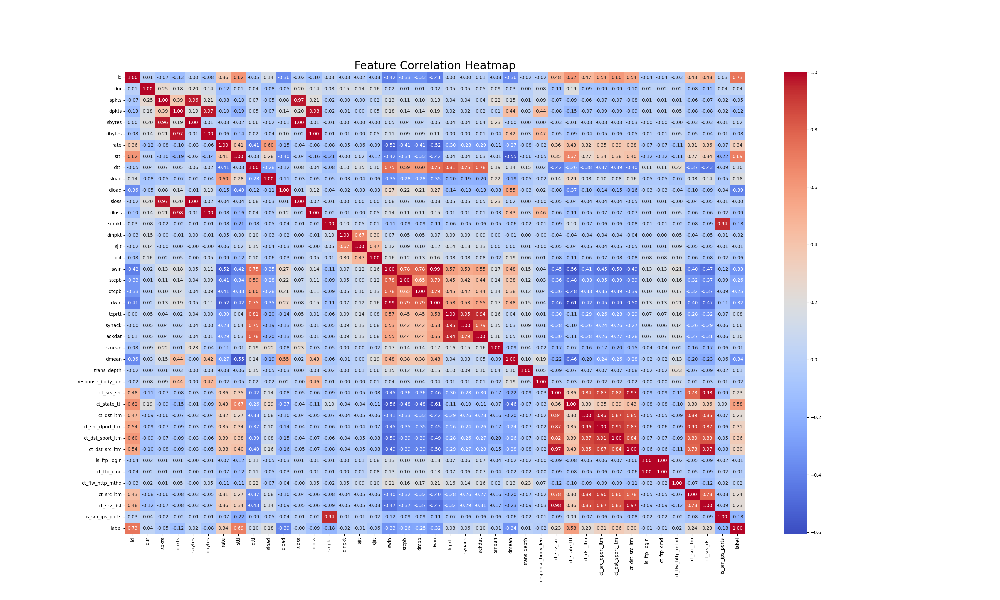

# VigiNIDS: Network Intrusion Detection System

## **What is a Network Intrusion Detection System (NIDS)?**
A Network Intrusion Detection System (NIDS) is a cybersecurity tool designed to monitor and analyze network traffic for malicious activities or policy violations. It plays a critical role in identifying potential threats in real-time and ensuring the security of systems and data.

### **Why is NIDS Important?**
- Detects unauthorized access and cyberattacks.
- Helps organizations protect sensitive data and prevent breaches.
- Provides actionable insights to enhance network security.

---

## **Dataset Overview**
### **Dataset Used**: UNSW-NB15
The UNSW-NB15 dataset is a benchmark dataset for evaluating intrusion detection systems. It contains real-world network traffic data combined with synthetic attack traffic.

### **Key Details**:
- **Source**: [UNSW-NB15 Dataset](https://research.unsw.edu.au/projects/unsw-nb15-dataset)
- **Features**: 49 features describing network traffic behavior.
- **Records**: 
  - Training set: 175,341 rows.
  - Testing set: 82,332 rows.
- **Classes**: 
  - `0`: Normal traffic.
  - `1`: Attack traffic.

---

## **Insights from the Data**
### **Basic Observations**:
- The dataset is well-structured and contains no missing values.
- There are only 4 categorical features that require encoding.
- In the `train_df`, there is a higher proportion of attack traffic compared to normal traffic. Conversely, the `test_df` has more normal traffic than attacks.

### **Correlation Analysis**:
- Features like `sbytes` and `spkts` are highly correlated, indicating potential redundancy.
- Many features have weak correlations with the target label (`label`), suggesting they might contribute less to the classification task.

---

## **Visualizations So Far**
### **Target Variable Distribution**

- The distribution shows the proportion of `Normal` and `Attack` labels in the dataset.

### **Correlation Heatmap**

- A heatmap showcasing relationships between features in the dataset. Strong correlations like those between `sbytes` and `spkts` are visible.

---

## **Next Steps**
1. Perform data preprocessing:
   - Encode categorical features.
   - Scale numerical features if necessary.
2. Train and evaluate machine learning models.
3. Fine-tune the best-performing models.
4. Present final results and insights.

---

## **References**
- UNSW-NB15 Dataset: [Link to Dataset](https://research.unsw.edu.au/projects/unsw-nb15-dataset)